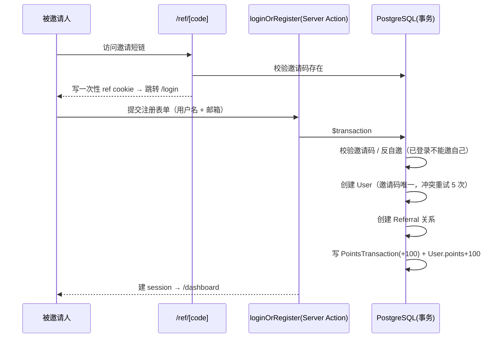

# 推荐返利系统

基于 Next.js 16 的无密码认证推荐返利应用：注册账号生成专属邀请链接，好友通过链接注册，邀请人立即获得积分奖励。

## 技术栈

| 层 | 选型 |
|---|---|
| 框架 | Next.js 16.3（App Router + Turbopack）· React 19 · TypeScript 5.9 |
| 数据库 | PostgreSQL 17 · Prisma 7.9（driver adapter `@prisma/adapter-pg`） |
| 校验 | zod 4（表单 schema） |
| 样式 | Tailwind CSS 4 |
| 测试 | Vitest 4 · React Testing Library · Testcontainers（PostgreSQL） |
| 容器 | Docker Compose（开发）· 多阶段 Dockerfile（生产） |
| CI/CD | GitHub Actions（lint → 单测 → 集成测试 → 推送 GHCR） |

## 快速开始

```bash
# 要求：Node 22+、pnpm 10+、Docker（开发环境可选）

# 方式一：本地直接开发（需要 postgres 可用，或复用下面 compose 的 db）
docker compose up -d db          # 只起数据库
pnpm install
cp .env.example .env             # 按需修改
pnpm db:migrate                  # 初始化表结构
pnpm dev                         # http://localhost:3000

# 方式二：全容器开发（推荐）
docker compose up -d --build     # 一键起 web + db
```

## 架构设计

### 分层结构

```
┌────────────────────────────────────────────────────────────┐
│ 展示层  src/app/*.tsx                                     │
│   /           落地页    /login       登录/注册表单         │
│   /dashboard   我的面板  /ref/[code]  邀请短链（Route）     │
└──────────────┬─────────────────────────────────────────────┘
               │
┌──────────────▼─────────────────────────────────────────────┐
│ 中间件  src/proxy.ts                                       │
│  乐观鉴权：仅检查 session cookie 存在性做路由级预过滤，     │
│  不查库；真实校验收敛到 DAL 层（代理 ≠ 安全边界）           │
└──────────────┬─────────────────────────────────────────────┘
               │
┌──────────────▼─────────────────────────────────────────────┐
│ 动作层  src/lib/auth/actions.ts   （'use server'）          │
│  loginOrRegister：登录/注册一表单（含 P2002 并发兜底）      │
│  logout                                                    │
└──────────────┬─────────────────────────────────────────────┘
               │
┌──────────────▼─────────────────────────────────────────────┐
│ 服务层  src/lib/auth/service.ts                            │
│  registerUser：注册核心事务（不含 cookie/redirect，可单测） │
│  校验邀请码 → 反自邀 → 建用户 → 建 Referral → 写流水        │
│  → 邀请人积分 +100                                         │
└──────────────┬─────────────────────────────────────────────┘
               │
┌──────────────▼─────────────────────────────────────────────┐
│ 数据访问层  src/lib/auth/dal.ts   （React cache 包裹）      │
│  verifySession / getCurrentUser / requireUser / 面板聚合查询│
└──────────────┬─────────────────────────────────────────────┘
               │
┌──────────────▼─────────────────────────────────────────────┐
│ 基础设施  src/lib/db.ts（Prisma 单例，globalThis 防泄漏）   │
│  src/lib/auth/session.ts（token 生成/hash/cookie）         │
│  src/lib/auth/definitions.ts（zod schema + 状态类型）      │
│  src/lib/auth/constants.ts（常量，无 server-only，proxy 复用）│
└────────────────────────────────────────────────────────────┘
```

### 核心数据流：邀请 → 积分



### 认证设计

- **无密码**：用户名 + 邮箱即账号；邮箱已存在时用户名匹配则登录，否则拒绝
- **会话**：32 字节随机 token 存 httpOnly/sameSite=lax cookie，DB 只存 sha256 哈希（泄库不可伪造），30 天 TTL
- **安全分层**：proxy 只做廉价预过滤，`dal.requireUser` 才是真正授权边界；Server Action 与 Route Handler 均不信任 proxy

### 目录结构

```
src/
├── app/
│   ├── page.tsx                 # 落地页
│   ├── login/                   # 登录页 + useActionState 表单
│   ├── dashboard/               # 我的面板（积分/邀请记录/流水）+ 复制链接组件
│   ├── ref/[code]/route.ts      # 邀请短链：校验 → 写 ref cookie → 跳登录
│   └── layout.tsx
├── lib/
│   ├── db.ts                    # Prisma 单例
│   ├── format.ts                # 纯函数工具
│   └── auth/                    # actions / service / dal / session / definitions / constants
└── proxy.ts                     # 中间件（乐观鉴权）
prisma/schema.prisma             # 数据模型（User/Session/Referral/PointsTransaction）
tests/integration/               # testcontainers 集成测试
```

## 数据模型

```prisma
User                Session               Referral
├─ id PK            ├─ tokenHash PK       ├─ id PK
├─ email 唯一        ├─ userId → User      ├─ referrerId → User (Cascade)
├─ name             └─ expiresAt          ├─ refereeId 唯一 → User (Cascade)
├─ referralCode 唯一                      └─ @@index([referrerId, createdAt])
├─ points
└─ createdAt/updatedAt

PointsTransaction
├─ id PK
├─ userId → User (Cascade)
├─ amount / reason
├─ referralId? → Referral (SetNull, 唯一)
└─ @@index([userId, createdAt])
```

关键约束：`email`/`referralCode` 全局唯一、`Referral.refereeId` 唯一（一人只能被邀一次）、删除用户级联清理会话与邀请关系。

## 测试

```bash
pnpm test              # 单元测试（无外部依赖，~1s）
pnpm test:watch        # watch 模式
pnpm test:integration  # 集成测试（testcontainers 起真实 PostgreSQL，需 Docker）
pnpm typecheck         # tsc --noEmit
pnpm lint              # ESLint
```

- **单测（Vitest + RTL）**：认证模块（actions/dal/service/definitions）、UI 组件、`/ref/[code]` 路由、纯函数。route 测试用 `vi.hoisted` mock Prisma，校验 handler 的参数姿势与响应格式
- **集成测（Testcontainers）**：每次测试启动一次性 `postgres:17-alpine` 容器 → `migrate deploy` → 真实 CRUD 与路由调用。验证 Prisma schema 与迁移一致、`@unique` 约束、积分事务等**单测 mock 覆盖不到的**行为
- 单测与集成测试通过 `vitest.config.mts` / `vitest.integration.mts` 双配置分离

## Docker 开发环境

```bash
docker compose up -d --build   # 全栈启动：web(3000) + db(5432)
docker compose down            # 停止（保留数据卷）
docker compose down -v         # 彻底重置（库清空，需重新 migrate deploy）
```

- **web**：源码 bind mount（热更新生效），命名卷隔离 `node_modules`/`.next`；`DATABASE_URL` 由 compose 注入（指向 `db` 主机名）
- **db**：`postgres:17-alpine`，命名卷持久化，`pg_isready` 健康检查；web 通过 `depends_on: service_healthy` 等库就绪
- **宿主机 vs 容器**两套连接串：宿主机用 `.env`（`localhost:5432`，供 `pnpm dev`/`prisma migrate`/`studio`），容器内用 compose `environment`

## CI/CD

`.github/workflows/ci.yml`，四个 job 顺序门禁：

```
lint(typecheck) ─┐
test-unit ───────┼─→ build-push（PR 只验证构建；main push 推 GHCR）
test-integration ─┘      tags: latest + sha-<commit>
```

- 镜像：`ghcr.io/yunkst/test`（多阶段 `Dockerfile.prod`，207MB，standalone 输出，构建期 `node-linker=hoisted` 规避 pnpm 符号链接与依赖追踪冲突）
- 集成测试 job 直接依赖 ubuntu-latest 自带的 Docker daemon
- 推送到 PR 分支不会触发镜像推送

## 环境变量

| 变量 | 说明 | 位置 |
|---|---|---|
| `DATABASE_URL` | PostgreSQL 连接串 | 宿主机 `.env` / 容器内 compose `environment` |

模板见 `.env.example`；`.env` 不入库（`.gitignore` 已排除 `.env*`）。
