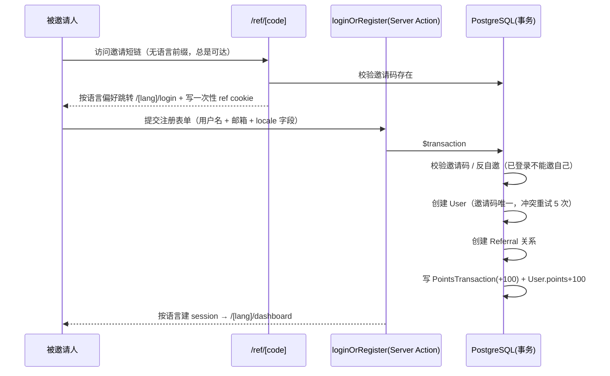

# 推荐返利系统

基于 Next.js 16 的无密码认证推荐返利应用：注册账号生成专属邀请链接，好友通过链接注册，邀请人立即获得积分奖励。支持中英双语。

> 本项目为机考项目题交付物，README 完整覆盖：本地运行方式、整体设计思路、设计取舍、AI 工具使用、未实现部分。

## 技术栈

| 层 | 选型 |
|---|---|
| 框架 | Next.js 16.3（App Router + Turbopack）· React 19 · TypeScript 5.9 |
| 数据库 | PostgreSQL 17 · Prisma 7.9（driver adapter `@prisma/adapter-pg`） |
| 校验 | zod 4（表单 schema，按语言字典生成） |
| 国际化 | 自定义轻量 i18n（`[lang]` 动态段 + zh/en 双字典，零运行时依赖） |
| 样式 | Tailwind CSS 4 |
| 测试 | Vitest 4 · React Testing Library · Testcontainers（PostgreSQL） |
| 容器 | Docker Compose（开发）· 多阶段 Dockerfile（生产） |
| CI/CD | GitHub Actions（lint → 单测 → 集成测试 → 推送 GHCR） |

## 如何在本地运行

### 前置要求

- Node.js 22+、pnpm 10+
- Docker（可选；方式二必需）

### 方式一：本地直接开发

```bash
docker compose up -d db      # 只起数据库（postgres:17，宿主机 5432 端口）
pnpm install
cp .env.example .env         # 按需修改连接串
pnpm db:migrate              # 初始化表结构
pnpm dev                     # http://localhost:3000（自动重定向到 /zh）
```

### 方式二：全容器开发（推荐，一键起全栈）

```bash
docker compose up -d --build
```

浏览器打开 http://localhost:3000，web(3000) 与 db(5432) 自动编排启动，源码热更新生效。

### 常用命令

| 命令 | 说明 |
|---|---|
| `pnpm dev` | 开发服务器（Turbopack） |
| `pnpm test` / `pnpm test:watch` | 单元测试 / watch 模式 |
| `pnpm test:integration` | 集成测试（testcontainers 起真实 PostgreSQL，需 Docker） |
| `pnpm typecheck` | `next typegen` 生成路由类型 + `tsc --noEmit` 类型检查 |
| `pnpm lint` | ESLint |
| `pnpm db:migrate` / `db:studio` / `db:generate` | Prisma 迁移 / Studio GUI / 重新生成客户端 |
| `docker compose down` / `down -v` | 停止（保留数据）/ 彻底重置（库清空后需重新 migrate） |

## 项目的整体设计思路

### 领域目标

无密码即注册、零成本邀请裂变：一次表单完成登录/注册（邮箱未注册即自动建号），每个用户拥有唯一邀请短链，新用户经邀请注册时邀请人**即时**获得 +100 积分。全程无 REST API 层，业务动作收敛为 Server Actions。

### 分层架构

```
┌─────────────────────────────── 展示层 src/app/[lang]/*.tsx ────────────────────────────────┐
│  /[lang] 落地页 · /[lang]/login 登录/注册 · /[lang]/dashboard 我的面板（含语言切换器）      │
│  /ref/[code] 邀请短链（Route，刻意不加语言前缀，保证任意路径可达）                         │
└──────────────┬─────────────────────────────────────────────────────────────────────────────┘
               │
┌──────────────▼────────────────────────────── 中间件 src/proxy.ts ──────────────────────────┐
│  ① 语言前缀补齐：cookie → Accept-Language → 默认语言，302 到 /zh|/en 并持久化 cookie       │
│  ② 乐观鉴权：仅检查 session cookie 存在性做路由级预过滤，不查库（代理 ≠ 安全边界）          │
└──────────────┬─────────────────────────────────────────────────────────────────────────────┘
               │
┌──────────────▼────────────────────────────── 动作层 src/lib/auth/actions.ts ───────────────┐
│  loginOrRegister：登录/注册一表单（P2002 并发兜底；表单 schema 按语言字典工厂生成）         │
│  logout                                                                                    │
└──────────────┬─────────────────────────────────────────────────────────────────────────────┘
               │
┌──────────────▼────────────────────────────── 服务层 src/lib/auth/service.ts ───────────────┐
│  registerUser：注册核心事务（纯业务，不含 cookie/redirect，可单测）                         │
│  校验邀请码 → 反自邀 → 建用户(邀请码唯一重试 5 次) → 建 Referral → 写流水 → 积分 +100       │
└──────────────┬─────────────────────────────────────────────────────────────────────────────┘
               │
┌──────────────▼────────────────────────────── 数据访问层 src/lib/auth/dal.ts ────────────────┐
│  verifySession / getCurrentUser / requireUser / 面板聚合查询（React cache 包裹防重复查询）  │
└──────────────┬─────────────────────────────────────────────────────────────────────────────┘
               │
┌──────────────▼────────────────────────────── 基础设施 ──────────────────────────────────────┐
│  src/lib/db.ts             Prisma 单例（globalThis 防泄漏，driver adapter pg）              │
│  src/lib/auth/session.ts   32B token 生成 / sha256 hash / cookie 读写                      │
│  src/lib/auth/definitions.ts  createAuthFormSchema(dict)（zod 按字典生成）                  │
│  src/lib/auth/constants.ts   常量（无 server-only，proxy 复用）                             │
│  src/lib/i18n/             locale.ts（解析/检测）· dictionaries.ts · zh/en 双字典 · format  │
└────────────────────────────────────────────────────────────────────────────────────────────┘
```

### 核心数据流：邀请 → 积分



### 认证与安全设计

- **无密码**：用户名 + 邮箱即账号；邮箱已存在时用户名匹配则登录，否则按当前语言拒绝
- **会话**：32 字节随机 token 存 httpOnly/sameSite=lax cookie，DB 只存 sha256 哈希（泄库不可伪造），30 天 TTL；**单会话模型**——每次登录吊销该用户全部旧会话（含被盗 cookie），并顺带惰性清理全局过期会话行，表不随登录次数膨胀
- **安全分层**：proxy 只做廉价预过滤，`dal.requireUser` 才是真正授权边界；Server Action 与 Route Handler 均不信任 proxy

### 国际化设计

- **`[lang]` 动态段** + `generateStaticParams` 预渲染 zh/en 两套页面，根路径由 proxy 302 补齐语言前缀，无首屏 CLS
- **字典**：`zh.ts` 为唯一事实源，`Dictionary` 类型（字面量放宽为宽类型）锚定 `en.ts` 结构，新增键必须双语同步（类型层面强制）
- **语言检测优先级**：`NEXT_LOCALE` cookie → Accept-Language（按 q 权重）→ 默认 zh；/ref 跳转复用同一套规则（`locale.ts` 无 server-only）
- **服务端消息字典化**：zod schema 与注册错误均由 `createAuthFormSchema(dict)` / 字典工厂按提交的 locale 生成，跨 RSC 边界安全传递

### 目录结构

```
src/
├── app/
│   ├── [lang]/                  # 国际化作根（layout + 页面 + dashboard + login）
│   │   ├── page.tsx             # 落地页
│   │   ├── login/               # useActionState 登录表单
│   │   └── dashboard/           # 积分/邀请记录/流水 + 复制链接组件
│   ├── ref/[code]/route.ts      # 邀请短链：校验 → 写 ref cookie → 跳语言化登录页
│   ├── layout.tsx               # 根布局（metadata 静态）
│   └── favicon.ico
├── components/
│   └── language-switcher.tsx    # 全局语言切换器
├── lib/
│   ├── db.ts                    # Prisma 单例
│   ├── format.ts                # 纯函数格式化工具
│   ├── i18n/                    # locale / dictionaries / zh / en / format
│   └── auth/                    # actions / service / dal / session / definitions / constants
└── proxy.ts                     # 中间件（语言路由 + 乐观鉴权）
prisma/schema.prisma             # 数据模型（User/Session/Referral/PointsTransaction）
tests/integration/               # testcontainers 集成测试
```

## 数据模型

```prisma
User                Session               Referral
├─ id PK            ├─ tokenHash PK       ├─ id PK
├─ email 唯一        ├─ userId → User      ├─ referrerId → User (Cascade)
├─ name             └─ expiresAt          ├─ refereeId 唯一 → User (Cascade)
├─ referralCode 唯一                      └─ @@index([referrerId, createdAt])
├─ points
└─ createdAt/updatedAt

PointsTransaction
├─ id PK
├─ userId → User (Cascade)
├─ amount / reason
├─ referralId? → Referral (SetNull, 唯一)
└─ @@index([userId, createdAt])
```

关键约束：`email`/`referralCode` 全局唯一、`Referral.refereeId` 唯一（一人只能被邀一次）、删除用户级联清理会话与邀请关系。

## 开发过程中做出的设计取舍

| # | 决策 | 取舍分析 |
|---|---|---|
| 1 | **无密码认证（自研会话）**，不用 Auth.js/NextAuth | 需求极简（用户名+邮箱即是账号），引入完整 OAuth 框架超重（YAGNI）；自研 session 仅 3 个文件，且 DB 只存哈希、30 天过期，安全性可控。代价：未来接第三方登录需自补 |
| 2 | **无 REST API，业务收敛 Server Actions** | 表单即页面，无第三方消费方；Server Actions 与 `useActionState` 天然契合表单态管理，省去 API 层 + fetch 胶水。与单一客户端（浏览器）场景匹配 |
| 3 | **注册为单事务（Prisma `$transaction`）** | 邀请人加积分必须与建号同生共死，杜绝"用户建了但积分没给"的中间态；P2002 并发兜底保证唯一码竞争安全。代价：可用性换取强一致 |
| 4 | **proxy 乐观鉴权 + DAL 真校验，双层安全** | 中间件不查库、只查 cookie 存在性，换取廉价路由过滤；真实授权收敛在 `dal.requireUser`（React `cache` 包裹防重复查库）。明确定性：代理 ≠ 安全边界 |
| 5 | **邀请码唯一冲突重试 5 次**，而非全局碰撞检测 | 10 字符 base64url（约 60 bit 熵）碰撞概率极低，重试是零成本兜底；避免先查后插的 TOCTOU 竞态 |
| 6 | **i18n 自研零依赖**，不用 next-intl | 仅 2 种语言、文案十几条；自研 `[lang]` 段 + 字典 + `Dictionary` 类型锚定，全栈不过百行；对比框架动辄依赖链更可控。代价：多语言扩展需手工补字典 |
| 7 | **标量语言兜底 `Widen` 类型** | `const en: Dictionary` 强约束键结构但放宽值类型，编译期保证 zh/en 结构同步，且不牺牲字面量提示 |
| 8 | **单测 mock DB + 集成测真实 DB 分层** | 单测（69 用例，覆盖率 Statements 95%）无外部依赖秒级反馈，覆盖业务/UI 分支；集成测用 testcontainers 起真实 postgres 验证 `@unique`、事务、迁移一致性等 **mock 覆盖不到** 的行为——"快而广 + 慢而准"互补 |
| 9 | **测试双 vitest 配置分离** | 单测 jsdom / 集成测 node + 串行 + 独立 hook 超时；避免单个命令混跑产生环境冲突，CI 职责清晰 |
| 10 | **生产构建 `node-linker=hoisted` 规避 pnpm 符号链接** | 默认 pnpm 的 `.pnpm` symlink 快照与 Next standalone 依赖追踪冲突（实测 `@swc/helpers` 缺失、镜像约 207MB 版本不一致）；hoisted 布局换取构建确定性 |
| 11 | **Docker 命名卷隔离 node_modules/.next** | 宿主机与容器工具链（Node/pnpm 版本）可能存在差异，隔离卷避免二进制产物互相污染；bind mount 源码保证热更新 |
| 12 | **CI 门禁顺序**：lint → 单测 → 集成测 → build-push | 便宜快的门禁前置（及时止损 Actions 配额），镜像构建（3min+）殿后；PR 只验证构建不推送，main 才推 GHCR |

取舍原则：**KISS / YAGNI 优先**——凡能证明当前场景不需要的能力（OAuth、REST、框架化 i18n）一律不引入；凡引入的（事务、双层安全、真实库集成测）都有明确的问题动因，并明记代价。

## 使用了哪些 AI 工具

开发全程使用 AI 辅助编码，覆盖需求到交付的完整链路：

- **Claude Code（Anthropic 官方 CLI）**：作为编码工具/载体，执行全部开发工作——项目脚手架初始化、架构设计与分层实现、认证与邀请事务的代码实现、单元测试与 testcontainers 集成测试编写与调试、Docker 多阶段镜像与 GitHub Actions 排错（典型如 `LayoutProps` typegen 时序、GHA cache 需 `docker-container` driver 等）。
- **DeepSeek v4 Flash**：作为 Claude Code 底层被调用的模型，驱动上述所有开发动作。

**使用方式与质量保障**：AI 生成代码不直接合入——每步改动均经本地 `pnpm typecheck` / `lint` / `test`（单测 + 集成测试）验证，最终经 GitHub Actions 全链路门禁（lint → 单测 → testcontainers 集成测 → 多阶段镜像构建推送 GHCR）后合入 main，AI 产物被置于同等测试护栏内。

## 未实现部分 / 未来完善

### 核心构想：配置即代码 + 运维 Agent（影子集群 GitOps）

> 以下构想来自作者 8 年小公司职场观察，涉及的每个技术难点均有真实实践基础，并非空谈。

**背景问题**：小公司中，"后台配置知识"往往只掌握在少数人手中。当后台可配置项量较大时，交接文档必然出现疏漏；老员工一旦离职或不在岗，业务推进（如调整活动奖励规则）就可能卡住——这是团队对个别成员的**隐形成本依赖**。

**解决思路**：**不做可配置后台**，只提供**只读界面 + 一个 Agent 入口**。任何修改需求（例如修改活动奖励规则）通过 Agent 完成：

```
用户提交需求 → Agent 翻译为后台修改 → 提交 gitops dev 分支
  → 部署到影子测试集群 → 管理员确认配置正确
  → 合并 dev 入主分支 → 自动部署正式生产（回滚 = git revert）
```

**优势**：
1. **配置可回滚**：即便影子集群测试未发现问题，生产异常也可秒级回滚（配置即代码，回滚就是 revert commit）
2. **0 知识依赖**：对于新人运维或任何有权限的人而言，只须理解业务系统与需求，**不需要了解配置的含义与位置**，极大降低上手门槛与交接摩擦

**落地所需**：① 测试/生产双集群 + GitOps 运维体系（ArgoCD 等）；② 可安全修改配置的运维 Agent（可复用本项目自研会话的权限模型）。

### 其他常规演进项

- **账号体系加固**：邮箱验证（防滥用注册）、邀请短链有效期与防刷规则
- **奖励规则引擎**：将 +100 积分等常量从代码提为可配置（与上述 Agent 构想衔接）
- **端到端测试**：引入 Playwright 覆盖完整注册→邀请→领奖链路（当前为单测 + 集成测双层）
- **生产可观测性**：结构化日志、指标与链路追踪；HTTPS、备份与恢复演练

## 测试策略

```bash
pnpm test              # 单元测试（无外部依赖，~1s）
pnpm test:integration  # 集成测试（testcontainers 起真实 PostgreSQL，需 Docker）
pnpm typecheck         # 类型检查（含 next typegen）
pnpm lint              # ESLint
```

- **单测（Vitest + RTL）**：认证模块（actions/service/dal/session/definitions）、i18n 模块（字典/locale/format）、UI 组件（页面/表单/语言切换器）、`/ref` 路由。route 测试用 `vi.hoisted` mock Prisma，校验 handler 参数姿势与响应格式。覆盖率 **Statements 95% / Branches 92% / Lines 95%**——含单会话事务语义、cookie 安全参数（httpOnly/sameSite/secure）、邀请事务、i18n 字典全线
- **集成测（Testcontainers）**：每次启动一次性 `postgres:17-alpine` → `migrate deploy` → 真实 CRUD 与路由调用，验证 schema 与迁移一致、`@unique` 约束、积分事务等单测 mock 覆盖不到的行为
- 单测与集成测试通过 `vitest.config.mts` / `vitest.integration.mts` 双配置分离

## Docker 开发环境

```bash
docker compose up -d --build   # 全栈启动：web(3000) + db(5432)
docker compose down            # 停止（保留数据卷）
docker compose down -v         # 彻底重置（库清空，需重新 migrate deploy）
```

- **web**：源码 bind mount（热更新生效），命名卷隔离 `node_modules`/`.next`；`DATABASE_URL` 由 compose 注入（指向 `db` 主机名）；**启动时自动执行 `prisma migrate deploy` + `prisma generate`**（幂等），全新 `postgres-data` 卷也能一键起，无需手动跑迁移
- **db**：`postgres:17-alpine`，命名卷持久化，`pg_isready` 健康检查；web 通过 `depends_on: service_healthy` 等库就绪
- **宿主机 vs 容器**两套连接串：宿主机用 `.env`（`localhost:5432`，供 `pnpm dev`/`prisma migrate`/`studio`），容器内用 compose `environment`

## CI/CD

`.github/workflows/ci.yml`，四个 job 顺序门禁：

```
lint(typecheck) ─┐
test-unit ───────┼─→ build-push（PR 只验证构建；main push 推 GHCR）
test-integration ─┘      tags: latest + sha-<commit>
```

- 镜像：`ghcr.io/yunkst/test`（多阶段 `Dockerfile.prod`，standalone 输出，非 root 用户运行，GHA cache 走 `docker-container` builder）
- 集成测试 job 直接依赖 ubuntu-latest 自带的 Docker daemon；推送到 PR 分支不触发镜像推送

## 环境变量

| 变量 | 说明 | 位置 |
|---|---|---|
| `DATABASE_URL` | PostgreSQL 连接串 | 宿主机 `.env` / 容器内 compose `environment` |

模板见 `.env.example`；`.env` 不入库（`.gitignore` 已排除 `.env*`）。